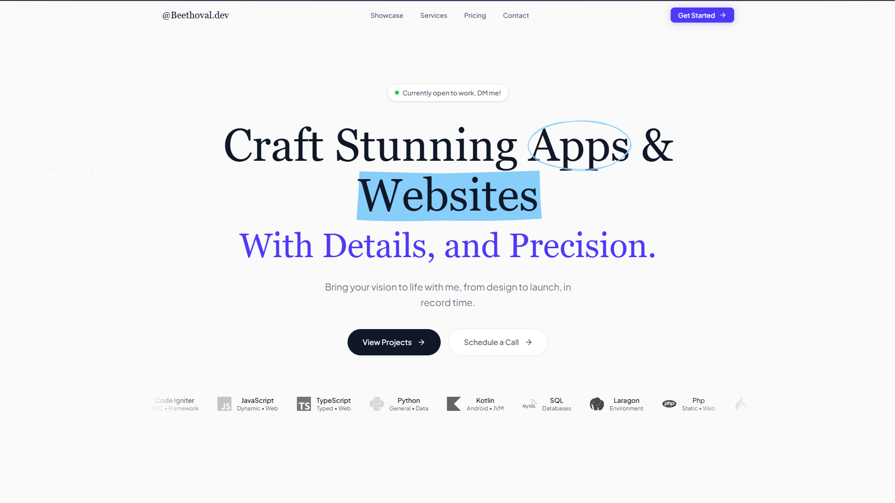

<p align="center"></p>

<h1 align="center">Personal Portfolio</h1>

<p align="center">A premium, high-performance developer portfolio built to showcase projects, skills, and experiences with a modern aesthetic.</p>

## Built With

This project is built using a powerful and modern technology stack:

*   **[Laravel 12](https://laravel.com/)** - The backend framework for robust server-side routing, API integration, and database management.
*   **[Inertia.js v2](https://inertiajs.com/)** - The glue that connects the Laravel backend seamlessly to the React frontend, eliminating the need to build a separate API.
*   **[React 19](https://react.dev/)** - For building a dynamic, interactive, and component-driven user interface.
*   **[Tailwind CSS v4](https://tailwindcss.com/)** - Utility-first CSS framework for rapid and highly customizable UI development.
*   **[Framer Motion](https://www.framer.com/motion/)** - Powers the sophisticated page transitions, scroll effects, and fluid micro-animations.
*   **[Radix UI](https://www.radix-ui.com/)** - Accessible, unstyled primitives for building high-quality design systems like dropdowns, dialogs, and tooltips.

## Features

*   **Server-Side Rendering (SSR) & SEO Optimized**: Delivers fast initial load times and fully server-rendered meta tags to guarantee maximum search engine visibility (Google Search Console verified).
*   **Dynamic Project Showcase**: A robust and flexible system to elegantly display your latest projects, powered by Inertia.js and dynamic JSON data (`projects.json`).
*   **Premium Animations**: Fluid micro-interactions, layout transitions, and scroll animations using Framer Motion and Lenis for a WOW-factor user experience.
*   **Fully Responsive & Accessible**: Flawless scaling from mobile screens to ultrawide desktops, alongside accessible Radix UI primitives.
*   **Dark Mode Integrated**: Deep, rich dark theme support out-of-the-box leveraging `next-themes` and custom styling for a sleek and modern appearance.

## Local Development Setup

To get a local copy up and running, follow these steps.

### Prerequisites

Ensure you have the following installed on your local development environment:
- PHP >= 8.2
- Composer
- Node.js & npm

### Installation Reference

1. **Clone the repository**
   ```bash
   git clone https://github.com/NauvalAssidq/portofolio_laravel.git
   cd portofolio_laravel
   ```

2. **Install PHP dependencies**
   ```bash
   composer install
   ```

3. **Install NPM packages**
   ```bash
   npm install
   ```

4. **Environment Setup**
   ```bash
   cp .env.example .env
   php artisan key:generate
   ```

5. **Start the development servers**
   
   Run the Vite frontend bundler:
   ```bash
   npm run dev
   ```
   Open another terminal and serve the Laravel application:
   ```bash
   php artisan serve
   ```

## License

Distributed under the MIT License. See `LICENSE` for more information.
